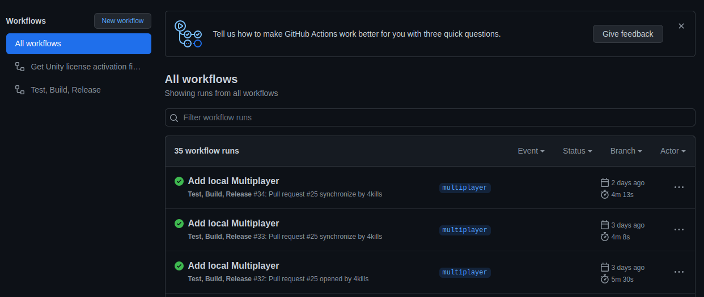
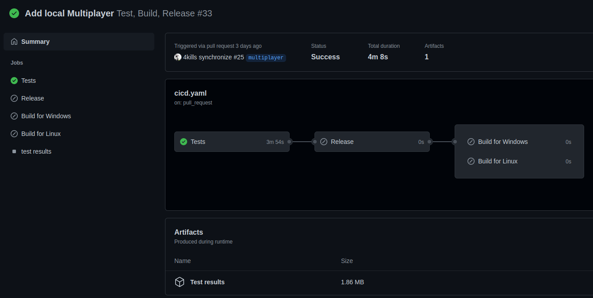
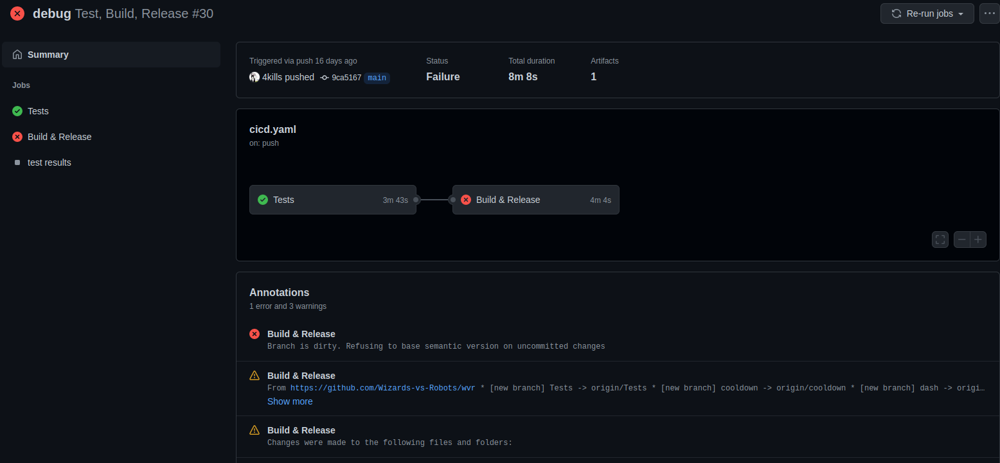

# Test Plan 

## Table of contents

- [1. Introduction](#1-introduction)
  * [1.1 Purpose](#11-purpose)
  * [1.2 Scope](#12-scope)
  * [1.3 Intended Audience](#13-intended-audience)
  * [1.4 Document Terminology and Acronyms](#14-document-terminology-and-acronyms)
  * [1.5  References](#15-references)
- [2. Evaluation Mission and Test Motivation](#2-evaluation-mission-and-test-motivation)
  * [2.1 Background](#21-background)
  * [2.2 Evaluation Mission](#22-evaluation-mission)
  * [2.3 Test Motivators](#23-test-motivators)
- [3. Target Test Items](#3-target-test-items)
- [4. Outline of Planned Tests](#4-outline-of-planned-tests)
  * [4.1 Outline of Test Inclusions](#41-outline-of-test-inclusions)
  * [4.2 Outline of Other Candidates for Potential Inclusion](#42-outline-of-other-candidates-for-potential-inclusion)
  * [4.3 Outline of Test Exclusions](#43-outline-of-test-exclusions)
- [5. Test Approach](#5-test-approach)
  * [5.1 Initial Test-Idea Catalogs and Other Reference Sources](#51-initial-test-idea-catalogs-and-other-reference-sources)
  * [5.2 Testing Techniques and Types](#52-testing-techniques-and-types)
    + [5.2.1 Data and Database Integrity Testing](#521-data-and-database-integrity-testing)
    + [5.2.2 Functional Testing](#522-functional-testing)
    + [5.2.3 Unit Testing](#523-unit-testing)
- [6. Entry and Exit Criteria](#6-entry-and-exit-criteria)
  * [6.1 Test Plan](#61-test-plan)
    + [6.1.1 Test Plan Entry Criteria](#611-test-plan-entry-criteria)
    + [6.1.2 Test Plan Exit Criteria](#612-test-plan-exit-criteria)
- [7. Deliverables](#7-deliverables)
- [7.1 Test Evaluation Summaries](#71-test-evaluation-summaries)
- [7.2 Reporting on Test Coverage](#72-reporting-on-test-coverage)
- [7.3 Perceived Quality Reports](#73-perceived-quality-reports)
- [7.4 Incident Logs and Change Requests](#74-incident-logs-and-change-requests)
- [7.5 Smoke Test Suite and Supporting Test Scripts](#75-smoke-test-suite-and-supporting-test-scripts)
- [7.6      Additional Work Products](#76------additional-work-products)
  * [7.6.1     Detailed Test Results](#761-----detailed-test-results)
  * [7.6.2     Additional Automated Functional Test Scripts](#762-----additional-automated-functional-test-scripts)
  * [7.6.3     Test Guidelines](#763-----test-guidelines)
  * [7.6.4     Traceability Matrices](#764-----traceability-matrices)
- [8. Testing Workflow](#8-testing-workflow)
- [9. Environmental Needs](#9-environmental-needs)
  * [9.1 Base System Hardware](#91-base-system-hardware)
  * [9.2 Base Software Elements in the Test Environment](#92-base-software-elements-in-the-test-environment)
  * [9.3 Productivity and Support Tools](#93-productivity-and-support-tools)
  * [9.4 Test Environment Configurations](#94-test-environment-configurations)
- [10. Responsibilities, Staffing, and Training Needs](#10-responsibilities--staffing--and-training-needs)
  * [10.1 People and Roles](#101-people-and-roles)
  * [10.2 Staffing and Training Needs](#102-staffing-and-training-needs)
- [11. Iteration Milestones](#11-iteration-milestones)
- [12. Risks, Dependencies, Assumptions, and Constraints](#12-risks--dependencies--assumptions--and-constraints)

## 1. Introduction

### 1.1 Purpose

The purpose of the Iteration Test Plan is to gather all of the information necessary to plan and control the test effort for a given iteration. It describes the approach to testing the software.
This Test Plan for Vaultionizer supports the following objectives:

- Identifies the items that should be targeted by the tests.
- Identifies the motivation for and ideas behind the test areas to be covered.
- Outlines the testing approach that will be used.
- Identifies the required resources and provides an estimate of the test efforts.

### 1.2 Scope

Unit testing for functionality and reliability. Focus is on the game object logic implementation. There will be no testing on utilities and functionalities provided by Unity (i.e. rendering and component system).

### 1.3 Intended Audience

This test plan contains more technically detailed information and does not provide a description of the application itself. Therefore this document is for advanced readers with the necessary background knowledge and should be used primarily by active developers of the project.

### 1.4 Document Terminology and Acronyms

| Abbr | Abbreviation                        |
|------|-------------------------------------|
| CI   | Continuous Integration              |
| n/a  | not applicable                      |
| SRS  | Software Requirements Specification |
| tbd  | to be determined                    |
| TDD  | Test Driven Development             |
| UI   | User Interface                      |

### 1.5  References

| Title                                                                   | Date       | Publishing organization   |
| ------------------------------------------------------------------------|:----------:| ------------------------- |
| [Blog](https://4kills.wordpress.com/)                                   | Apr. 2022  |                  |
| [GitHub Repository](https://github.com/Wizards-vs-Robots/documentation)                                                   | Apr. 2022|                  |
| [Use Cases](https://github.com/Wizards-vs-Robots/documentation/tree/main/uc)                                        | Apr. 2022  |                  |
| [SRS](srs.md)                          | Apr. 2022  |                  |
| [SAD](sad.md)                               | Apr. 2022  |                  |

## 2. Evaluation Mission and Test Motivation

### 2.1 Background

Test coverage for our project gives us the possibility to be sure that future changes will not lead to functional problems. With the integration of testing into the deployment process we can ensure that just stable versions of our project which meet the desired quality requirements are being deployed. This leads to a better control of new implementations and the deployment process.

### 2.2 Evaluation Mission

Test are necessary for providing stable and working versions of our project and to ensure that bugs or other problems can be identified as early as possible. The functionality of our methods and implementations can be verified automatically with the concept of continuous testing. With Test Driven Development (TDD) the tests are getting written before the functionality itself gets implemented. TDD helps a lot to prevent problems and bugs before they occur.

### 2.3 Test Motivators

Quality as well as stability and functional risks motivated us to use testing for this project. To ensure our application and its functions fulfill the requirements, it is very important to test these. Additionally, it helps implementing the Use Cases with a correct working result.

## 3. Target Test Items

In the following list the tested parts of our application are listed. Tests will cover the main backend functionality as well as the logical implementations in the QML UI part.

Tested parts:
- Wave System
- Cooldowns
- Mathematical components
- Serialization/Deserialization

## 4. Outline of Planned Tests

### 4.1 Outline of Test Inclusions

All mentioned test targets will be tested with unit tests.
The tests themselves are not going to be tested and will not be part of the calculation of code coverage.

### 4.2 Outline of Other Candidates for Potential Inclusion

User interface testing would be an additional option to provide a working application. Furthermore performance testing of the application might be an interesting part of quality management to ensure a stable application that fulfills the performance requirements.

### 4.3 Outline of Test Exclusions

Testing the interface in Unity is quite a challenge because it cannot be tested with conventional interface testing technologies such as Selenium, due to no DOM tree. Performance testing is unlikely to prove effective due to many performance affecting parameters being out of our influence.

## 5. Test Approach

### 5.1 Initial Test-Idea Catalogs and Other Reference Sources
Optimally, we use TDD (Test Driven Development) for newly created test targets. Since most of our code is already done,
we obviously cannot make tests before writing up the tests. For new tests, however, this is possible.
For already existing code, we try to make tests, which are as little biased as possible.

### 5.2 Testing Techniques and Types

#### 5.2.1 Data Integrity Testing

|                        | Description                         | 
|------------------------|-------------------------------------|
| Technique Objective    | Ensure that the implemented functions are working as expected. |
| Technique              | Implement Unit tests |
| Oracles                | Test Logs, console printings and code coverage calculations |
| Required Tools         | Unity, Rider, GitHub Actions |
| Success Criteria       | All tests pass and the required code coverage is given |
| Special Considerations | - |

#### 5.2.2 Functional Testing

|                        | Description                         | 
|------------------------|-------------------------------------|
| Technique Objective    | Ensure that the implemented functions are working as expected. |
| Technique              | Implement Unit tests |
| Oracles                | Test Logs, console printings and code coverage calculations |
| Required Tools         | Unity, Rider, GitHub Actions |
| Success Criteria       | All tests pass and the required code coverage is given |
| Special Considerations | - |

#### 5.2.3 Unit Testing

|                        | Description                         | 
|------------------------|-------------------------------------|
| Technique Objective    | Ensure that the implemented functions are working as expected. |
| Technique              | Implement Unit tests |
| Oracles                | Test Logs, console printings and code coverage calculations |
| Required Tools         | Unity, Rider, GitHub Actions |
| Success Criteria       | All tests pass and the required code coverage is given |
| Special Considerations | - |

## 6. Entry and Exit Criteria

### 6.1 Test Plan

#### 6.1.1 Test Plan Entry Criteria

The process of testing is to be executed when a new version of the application was committed and built on the main Branch on the GitHub Repository.

#### 6.1.2 Test Plan Exit Criteria

The process of testing leads to a passing of all tests without errors. Only when that condition is met, construction and deployment
can be triggered.

## 7. Deliverables

## 7.1 Test Evaluation Summaries

The summary can be found under:
https://github.com/Wizards-vs-Robots/wvr/actions/workflows/cicd.yaml

The overview looks as follows:

The detail view for a successful run informs about the run time of the test, the issuer, the target platforms and the
executed test parts:

The detail view for a failed run additionally informs about the failed test part, the reason of its failure and additional
warnings:

## 7.2 Reporting on Test Coverage

Reporting is done by GitHub actions and the results can be inspected under the GitHub actions tab in our development repository.

## 7.3 Perceived Quality Reports

n/a

## 7.4 Incident Logs and Change Requests

Test are managed in JetBrains Rider, recorded and tracked with GitHub Actions.

## 7.5 Smoke Test Suite and Supporting Test Scripts

n/a

## 7.6      Additional Work Products
n/a

### 7.6.1     Detailed Test Results
See section [7.2](#72-reporting-on-test-coverage)

### 7.6.2     Additional Automated Functional Test Scripts
n/a
### 7.6.3     Test Guidelines
n/a

### 7.6.4     Traceability Matrices
n/a

## 8. Testing Workflow

Tests are automatically ran before deployment on GitLab.

## 9. Environmental Needs

### 9.1 Base System Hardware

For testing the build status no specific hardware is required.

### 9.2 Base Software Elements in the Test Environment

The following base software elements are required in the test environment for this Test Plan.

| Software Element Name |  Type and Other Notes                        |
|-----------------------|----------------------------------------------|
| Android Studio        | Test Runner / IDE                            |
| IntelliJ              | Test Runner / IDE                            |
| JUnit 4               | Unit testing library                         |
| Espresso              | UI testing library                           |
| Cucumber              | human readable test definitions              |

### 9.3 Productivity and Support Tools

n/a

### 9.4 Test Environment Configurations

The following Test Environment Configurations need to be provided and supported for this project.

| Configuration Name                | Description | Implemented in Physical Configuration |
|-----------------------------------|-------------|---------------------------------------|
| GitHub Actions                    | Automated CI/CD provided by GitHub            | n/a                                      |
| Unity C# Test Suite               | Integrated in Unity project            |                                       |

## 10. Responsibilities, Staffing, and Training Needs

### 10.1 People and Roles

This table shows the staffing assumptions for the test effort.

| Human Resources  |  Minimum Resources Recommended  |  Specific Responsbilities or comments  |
|--------|--------------|-------------------|      
|Test Manager|1|Ensures that testing is complete and conducted for the right motivators|                                             
| Test Analyst| 1 | Analyses what to test  |
| Tester  |  4   | Implements and executes the tests.     |

### 10.2 Staffing and Training Needs

n/a

## 11. Iteration Milestones

We want to keep over 10% code coverage.

## 12. Risks, Dependencies, Assumptions, and Constraints

Risks regarding the integration of new Unit Tests into our Test workflow will be handled by the Implementer directly.                                                                  
