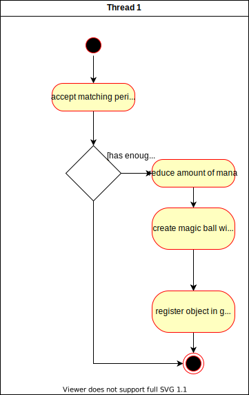

# Use-Case Specification: Casting Spells

# 1. Casting Spells

## 1.1 Brief Description
This use case describes that the wizard can cast some spells, which deplete
his mana resources and then bounce of into infinity until they hit something.

## 1.2 Mockup
The wizard has loaded his attack (selected it, so the mist is flying around)  

After the wizard casted his spell, his mana goes down and the ball of fire
is sent flying:  

## 1.3 Screenshots
<INSERT IMAGE HERE>

# 2. Flow of Events

## 2.1 Basic Flow
The wizard must issue the right peripheral signal, may it be keyboard or
joystick input or similar. Then it is checked, whether he has enough mana
to cast the spell. If he does, he reduces his mana stock and an object,
which contains information matching his selected spell type, is generated.
This in turn is then given to the game handler, which will move and render it.

### Activity Diagram

### .feature File
[Cast Spell](../features/cast_spell.feature)

## 2.2 Alternative Flows
n/a

# 3. Special Requirements
n/a

# 4. Preconditions
The preconditions for this use case are:
1. The wizard is alive.
2. The wizard is able to cast the spell.

# 5. Postconditions
The postconditions for this use case are:
1. The mana stock is now lower due to casting the spell.
2. An object representing the spell is wandering around.
