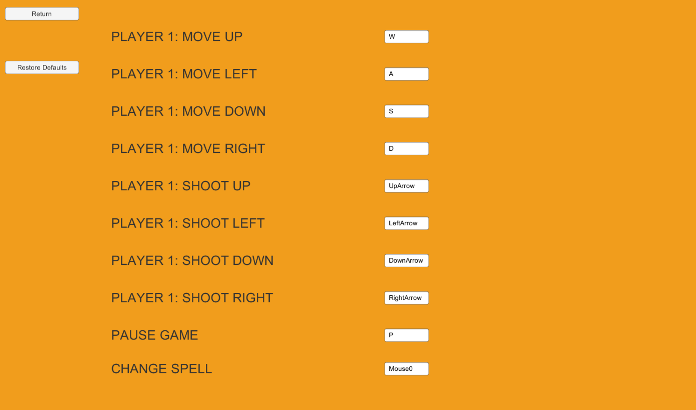

# Use-Case Specification: Change Settings

# 1. Change Settings

## 1.1 Brief Description
This use case describes that different settings can be adapdet to provide an individualized gameing experience.

## 1.2 Mockup
 n/a

## 1.3 Screenshots

The key bindings menu.

# 2. Flow of Events

## 2.1 Basic Flow
When in the main menu, the settings can be customized via the options button. Included settings are game speed and keybindings.

### Activity Diagram

### .feature File
[Cast Spell](../features/.feature)

## 2.2 Alternative Flows
n/a

# 3. Special Requirements
n/a

# 4. Preconditions
The preconditions for this use case are:
1. The game is in the main menu

# 5. Postconditions
The postconditions for this use case are:
1. The game experience is different, according to the different settings
