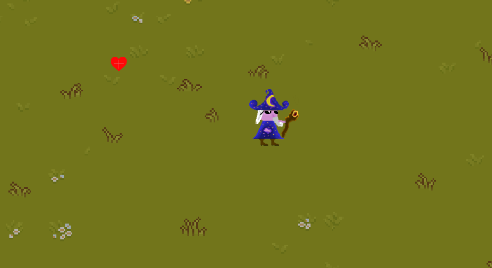
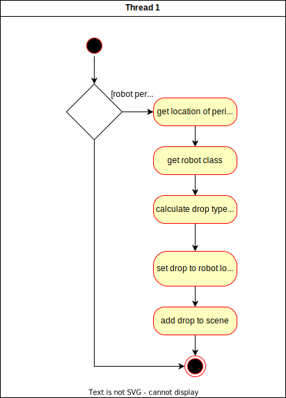

# Use-Case Specification: Drop Reward

# 1. Drop Reward
## 1.1 Brief Description
When a robot gets defeated, he has a chance to drop an item. This can either be health ponts, mana points or an additional score item.
## 1.2 Mockup

n/a
## 1.3 Screenshots

This is an example of an drop of 50 health points (in form of a small red heart).

# 2. Flow of Events

## 2.1 Basic Flow

With a certain propability depending on robot type and wave progression, each robot drops one available reward when it's defeated.

### Activity Diagram

### .feature File
n/a

## 2.2 Alternative Flows
n/a

# 3. Special Requirements
n/a

# 4. Preconditions
The preconditions for this use case are:
1. The game is in a running state.
2. A robot is defeated (= gets 0 HP from a wizard interaction)

# 5. Postconditions
The postconditions for this use case are:
1. The robot no longer exists
2. Either one of the available drops is in its place or not (when unlucky)

