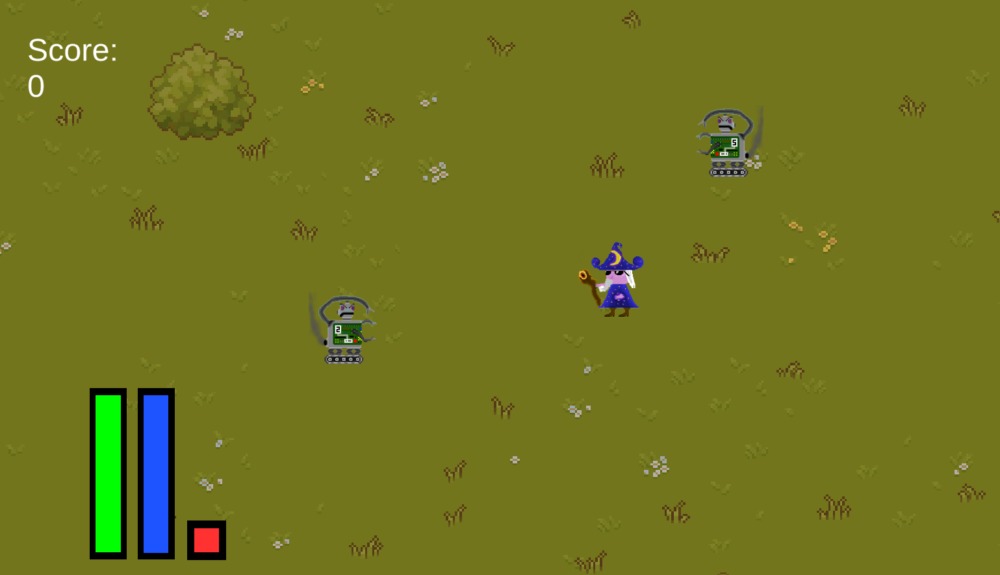
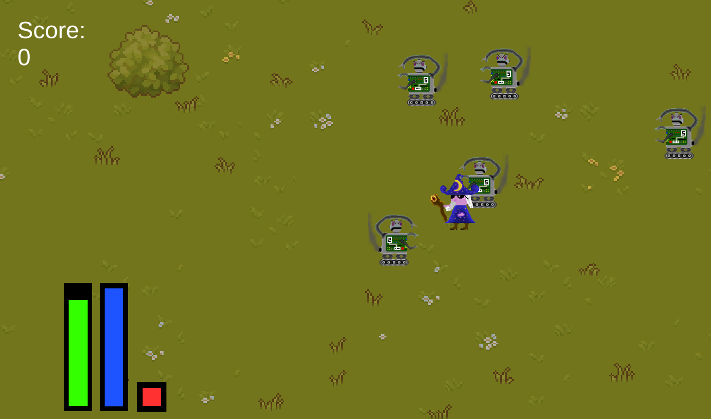
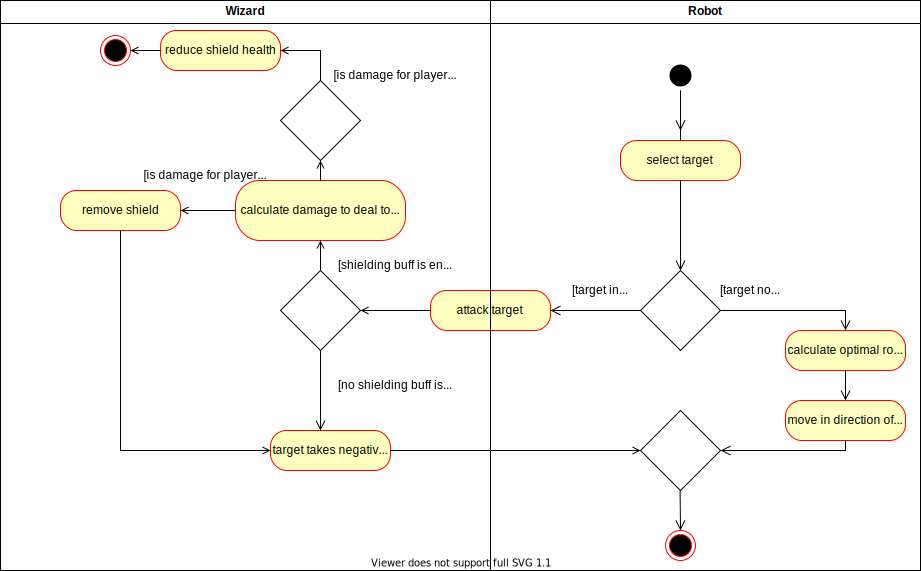

# Use-Case Specification: Fight Wizard

# 1. Fight Wizard

## 1.1 Brief Description
This use case describes that robots attack the wizard(s).

## 1.2 Mockup

Mockup one shows the robots before the activity diagram is executed. 

Mockup two shows the robots during activation of the activity diagram.  
All robots except the one closest to the wizard have already moved while the one closest to the wizard is currently attacking.

## 1.3 Screenshots

As can be seen, the robots move closer to the wizard, some even from outside the screenshot. When they come too close, the health bar is being lowered (green bar to the left).

# 2. Flow of Events

## 2.1 Basic Flow
During each game tick, the following is done by the AI actor in order to attack the player:
- select target 
- check if the target is in attack range and attack
- otherwise, calculates the optimal route to the target and move along that direction 

### Activity Diagram

### .feature File

[Fight Wizard Feature File](../features/fight_wizard.feature)

## 2.2 Alternative Flows
n/a

# 3. Special Requirements
n/a

# 4. Preconditions
The preconditions for this use case are:
1. The game is in a running state
2. A roboter wave has started.
3. The attacking robot has been spawned.
4. There are possible targets.

# 5. Postconditions
The postconditions for this use case are:
1. All spawned robots are either closer to a target or
2. have attacked a target
3. The AI has used all robots.
