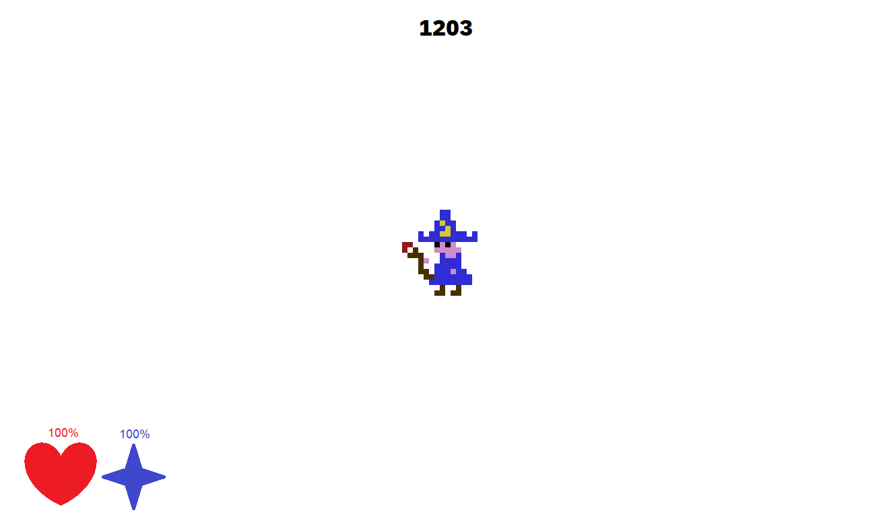
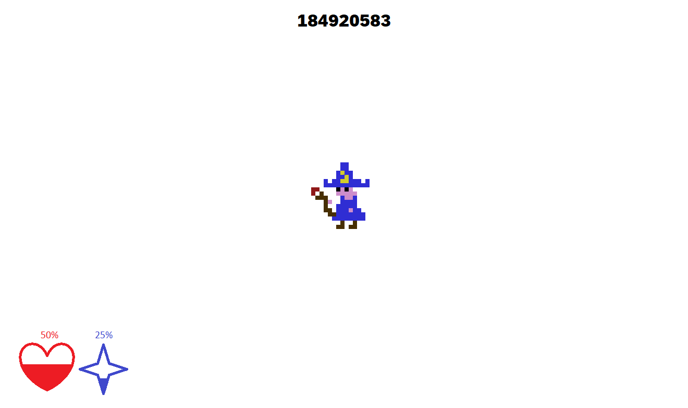
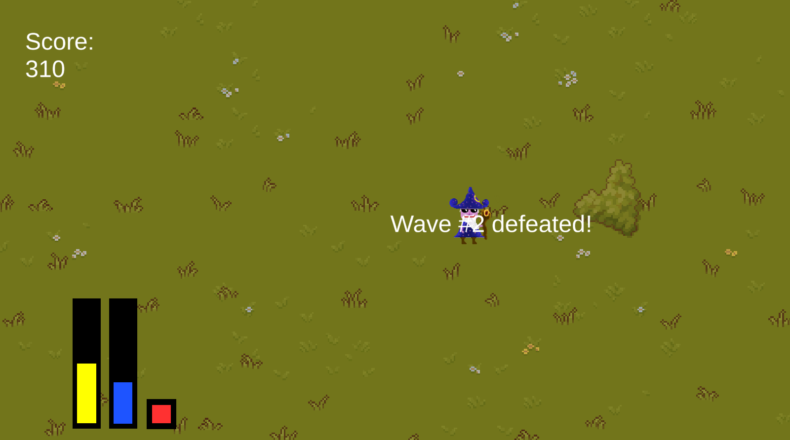
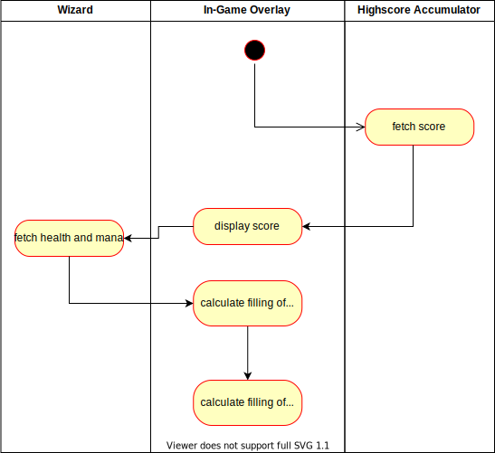

# Use-Case Specification: Show Game Information (HUD)

# 1. Show Game Information (HUD)

## 1.1 Brief Description
This use case describes that the overlay shows the player the state of the game by providing them with game information for the player to make decisions. The information provided are health points(HP), mana points(MP) and stamina of the player(s) (not visible in the mockup, but in the screenshot), as well as the score. 

## 1.2 Mockup
The first mockup shows the game HUD when the player has full HP and MP. The bottom left shows the HP and MP in percentages (red and blue respectively) and is additionally visualized by a red heart (HP) and a blue star (MP). They are partially filled according to the current HP/MP percentage (see mockup two for more details).
Additionally the score is displayed on the top center of the screen. 

This mockup shows in essence the same HUD elements as mockup one but with a higher score and partially filled HP/MP meters. 

## 1.3 Screenshots

all relevant game information is shown on the display in different colors.

# 2. Flow of Events

## 2.1 Basic Flow
The game periodically triggers this use case. The system then fetches the score from the entity responsible for keeping track of the score. Additionally, the system fetches the current HP and MP from the player(s), calculates its depletion level and displays the percentages and HP/MP meters. 

### Activity Diagram

### .feature File
[HUD Feature File](../features/hud.feature)

## 2.2 Alternative Flows
n/a

# 3. Special Requirements
n/a

# 4. Preconditions
The preconditions for this use case are:
1. The game has been started.
2. The player is not yet defeated.

# 5. Postconditions
The postconditions for this use case are:
1. All game information are correctly updated and displayed. 
