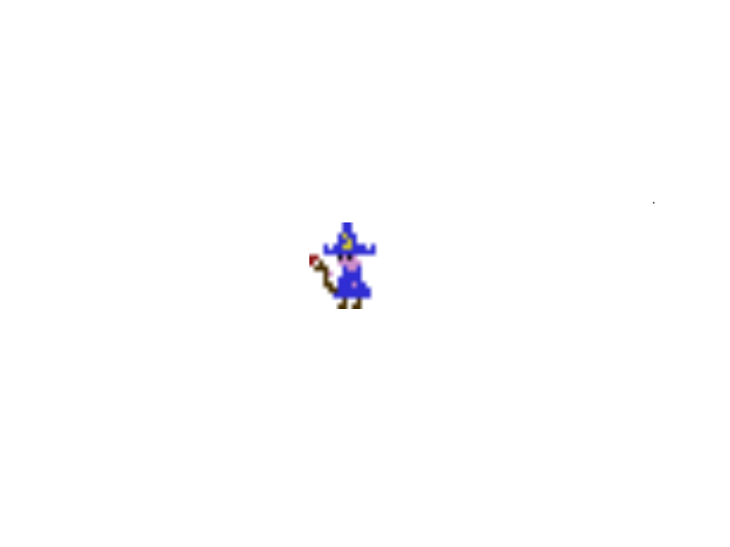
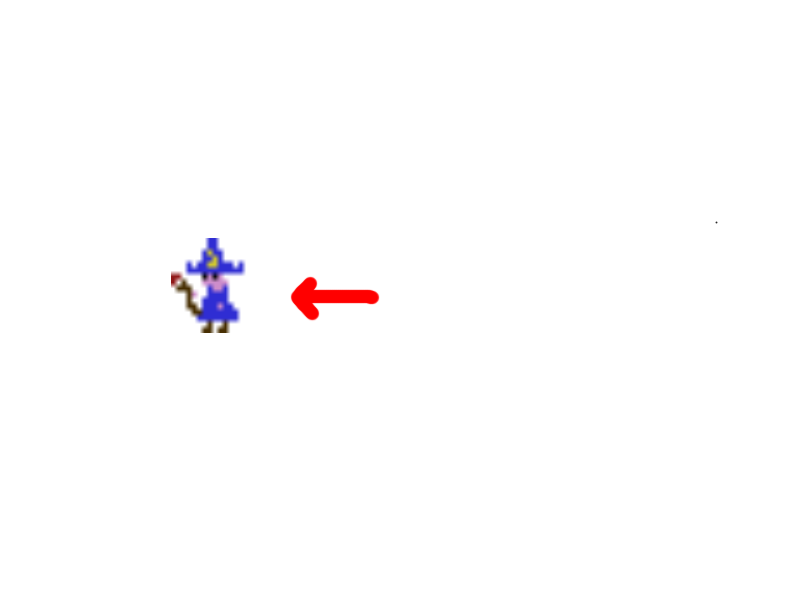
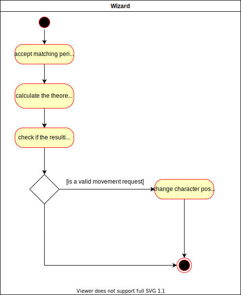

# Use-Case Specification: Moving the wizard

# 1. Moving the wizard

## 1.1 Brief Description
This use case describes that the player can move the wizard around by using accepted input from a keyboard or a gamepad.

## 1.2 Mockup
The Wizard before he moves.

Since nothing is blocking the wizard, he has moved, in this example to the left.

## 1.3 Screenshots

# 2. Flow of Events

## 2.1 Basic Flow
The player must press a valid input key, then it is checked if that input is valid at this moment

### Activity Diagram

### .feature File

## 2.2 Alternative Flows
n/a

# 3. Special Requirements
n/a

# 4. Preconditions
The preconditions for this use case are:
1. The game is in a running state

# 5. Postconditions
The postconditions for this use case are:
1. The game is in a running state
