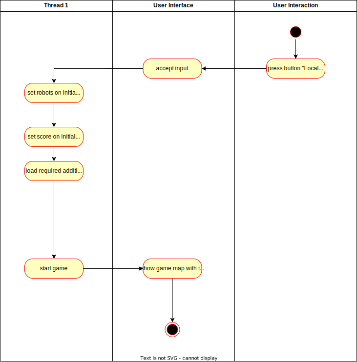

# Use-Case Specification: Multyplayer

# 1. Local multiplayer
## 1.1 Brief Description
Two people can play together using one ore more input peripherals that are connected to the same multiplayer. Thay play both as robots with independent Health and Mana models against the same robots.
## 1.2 Mockup

n/a
## 1.3 Screenshots

n/a

# 2. Flow of Events

## 2.1 Basic Flow

When the game starts, two robots play against robots that come in stronger waves compared to the singleplayer game mode.

### Activity Diagram

### .feature File
n/a

## 2.2 Alternative Flows
n/a

# 3. Special Requirements
n/a

# 4. Preconditions
The preconditions for this use case are:
1. The game is not in a running state

# 5. Postconditions
The postconditions for this use case are:
1. The game is in a running state
2. Score and robots are in the initial state
3. Use case spawn_wave is adapted to the local multiplayer

