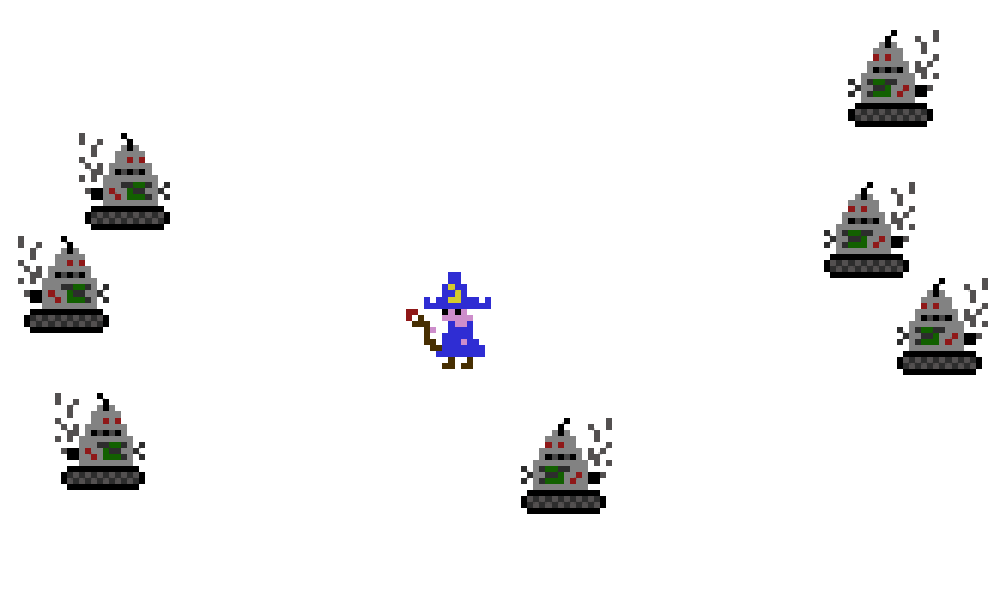

# Use-Case Specification: Fight Wizard

# 1. Fight Wizard

## 1.1 Brief Description
This use case describes that the AI (embodied by robots) attacks the wizards.

## 1.2 Mockup

Mockup one shows the robots before the activity diagram is executed. 

Mockup two shows the robots during activation of the activity diagram.  
All robots except the one closest to the wizard have already moved while the one closest to the wizard is currently attacking.

## 1.3 Screenshots

# 2. Flow of Events

## 2.1 Basic Flow
During each game tick (internal update), the following is done by the AI actor
in order to attack the player:
(a) select target  
(b) check if the target is in attack range 
(c1) if he is, then he tries to attack 
  (c1.1) if the target has a shielding buff, then the attack deals no 
  (c1.2) negative effect; otherwise, it does 
(c2) if he is not, then the robot calculates the optimal route to the target 
(d) the robot moves along the direction  

### Activity Diagram

### .feature File

## 2.2 Alternative Flows
n/a

# 3. Special Requirements
n/a

# 4. Preconditions
The preconditions for this use case are:
1. The wave has started.
2. The attacking robot has been spawned.
3. There are possible targets.

# 5. Postconditions
The postconditions for this use case are:
1. A robot is taking the optimal route to the targeted (depending on the robot class: e.g. low vitals, closest etc.) wizard.
2. The target has been attacked if the robot was near enough.
3. The AI has used all robots.
