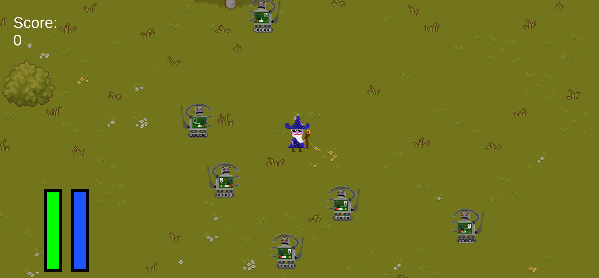
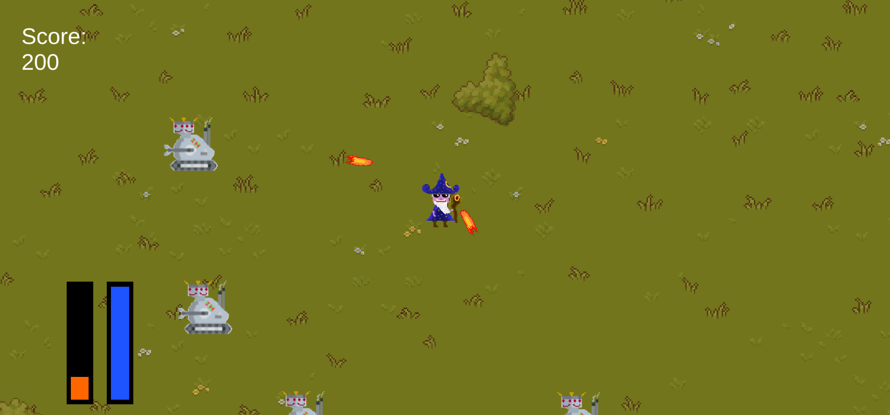
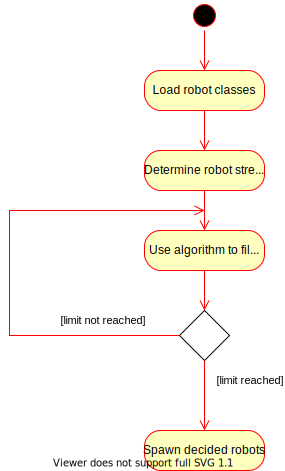

# Use-Case Specification: Spawn Different Robot Classes

# 1. Spawn Different Robot Classes

## 1.1 Brief Description
This use case describes that the Game (more precisely its Wave Manager) may create several types of robots 
with different attributes, behaviors, strenghts and weaknesses. 

## 1.2 Mockup
See [1.3 Screenshots](#13-screenshots) for details.

## 1.3 Screenshots

Here you can see the melee type robots attacking. They will approach the wizard until they are in melee range in order to then perform 
one melee attack that deals physical damage.

Here you can see ranged type robots attacking. They approach the wizard until they are in attack range to then perform a ranged attack 
in the form of a fireball that deals fire damage.

# 2. Flow of Events

## 2.1 Basic Flow
The Game (Wave Manager) is activated and tasked to decide upon the robots (and their classes) for the next wave. 
To this end, the Game considers the multiple classes that are available for creation. Each class has a strength rating 
and number of spawns. With this, the Game solves a Knapsack Problem in order to fill the next wave with robots. 
The robots are then created in the game with random starting positions and a random time delay.  
There are several tweaking possibilties to the decision algorithm for balancing purposes.

### Activity Diagram

### .feature File
[Spawn Different Robot Classes Feature File](../features/spawn_different_robot_classes.feature)

## 2.2 Alternative Flows
n/a

# 3. Special Requirements
n/a

# 4. Preconditions
The preconditions for this use case are:
1. The wizard is alive.
2. The wizard has defated the previous wave or it is the first wave.

# 5. Postconditions
The postconditions for this use case are:
1. Several robots of potentially different classes have been spawned in predefined numbers.
