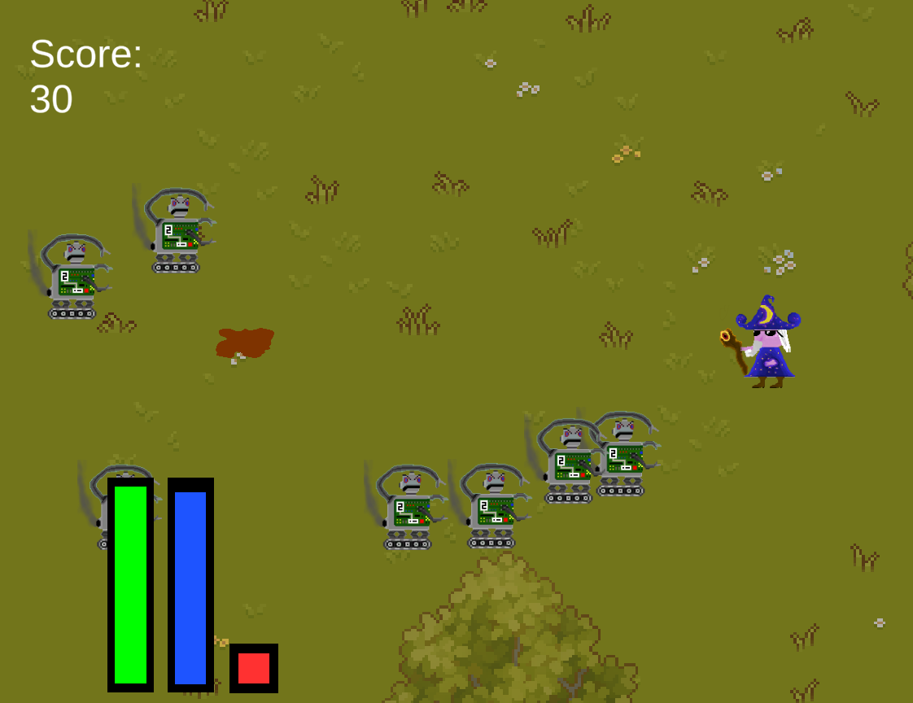

# Use-Case Specification: Spawn Wave

# 1. Spawn wave

## 1.1 Brief Description
This use case describes that robots get spawned in waves, which are progression relevant entities.

## 1.2 Mockup

## 1.3 Screenshots

There are no robots after a wave is defeated.

Multiple Robots spawn nearly simultanously.

# 2. Flow of Events

## 2.1 Basic Flow
At the start of the game or after a wave of robots is defeated, the game realizes the need to spawn a wave. Then, it calculates the needed strenght of the wave and spawns the according robots at fitting locations.

### Activity Diagram

### .feature File
n/a

## 2.2 Alternative Flows
n/a

# 3. Special Requirements
n/a

# 4. Preconditions
The preconditions for this use case are:
1. The game is in a running state.
3. There is no active robot wave

# 5. Postconditions
The postconditions for this use case are:
1. The next robot wave is active
2. The robots belonging to the wave are spawned

