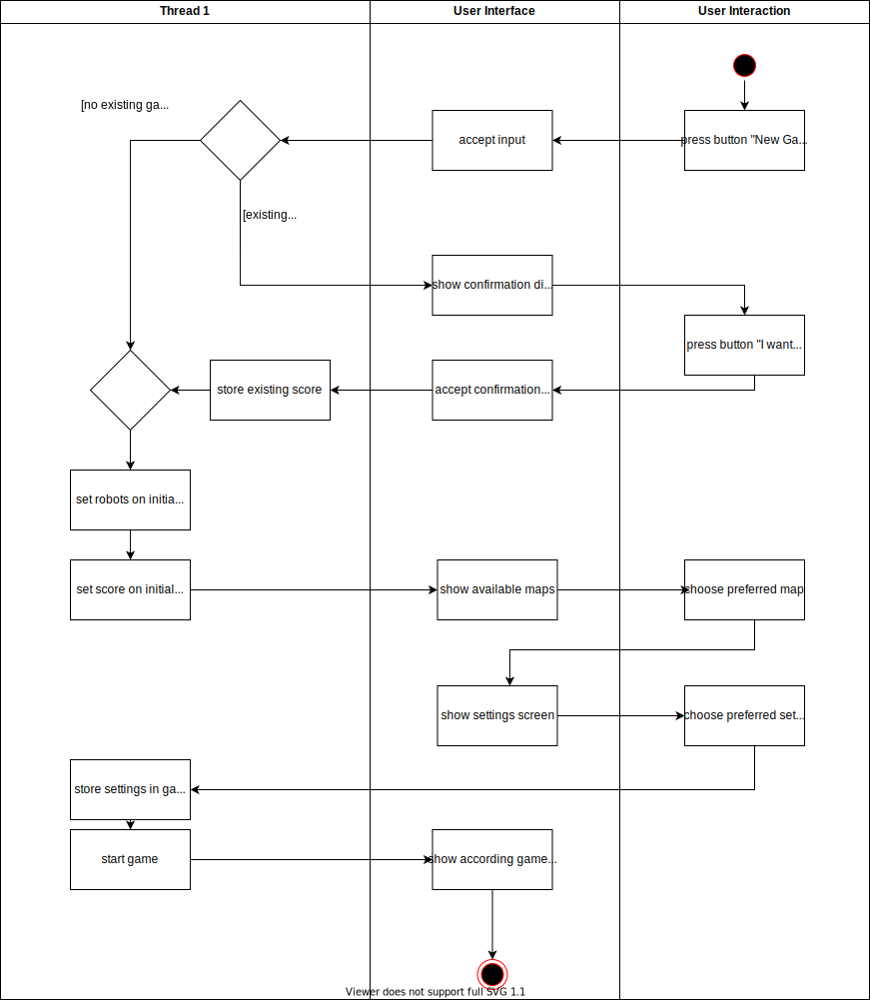

# Use-Case Specification: Starting Single Player Games

# 1. Starting Single Player Games

## 1.1 Brief Description
This use case describes that the player can start a single player game either at the beginning of his journey or from the pause menu. This starts a completely new run, whith most rudimentary spells and robots. Starting a game allows for adjusting optional settings for this round of the game. The level design system allows for different playable maps for the player. These maps can be optionally chosen after starting a game.

## 1.2 Mockup

## 1.3 Screenshots

# 2. Flow of Events

## 2.1 Basic Flow
The player must press the button labelled "new game". Then it is checked, whether he is currently in a game. If they are, they'll be asked to confirm their decision. If they do, robots, spells and the score return to their initial state and the paused state will resume. 

### Activity Diagram

### .feature File
[Start Game](../features/start_game.feature)

## 2.2 Alternative Flows
n/a

# 3. Special Requirements
n/a

# 4. Preconditions
The preconditions for this use case are:
1. The game is in a paused state (which it is in the beginning as well)

# 5. Postconditions
The postconditions for this use case are:
1. The game is in a running state
2. Score and robots are in the initial state
