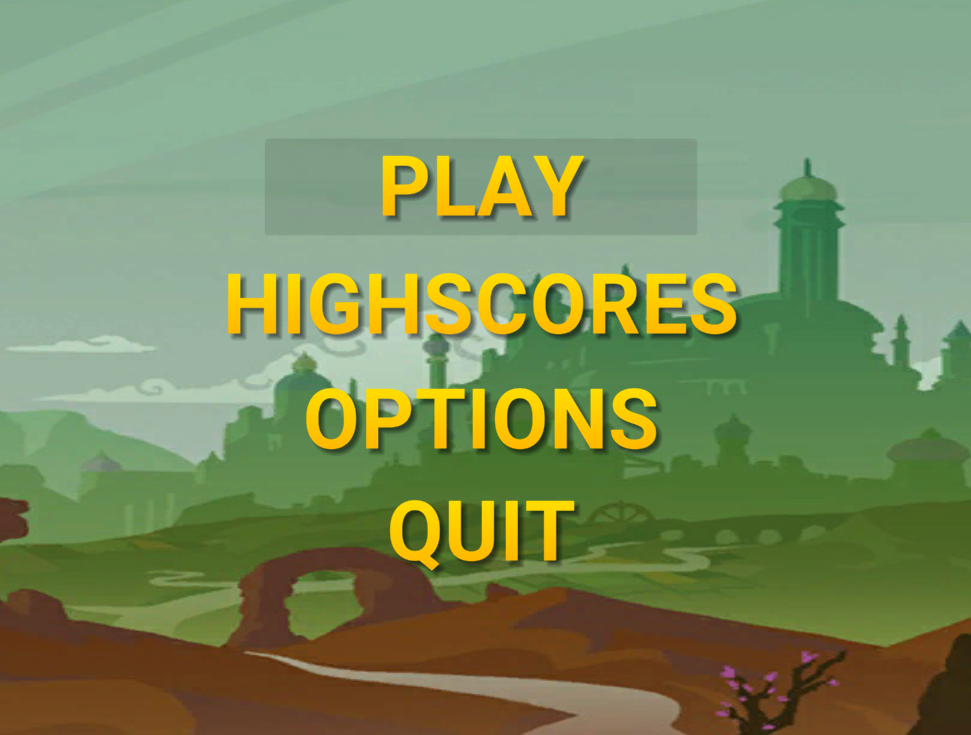
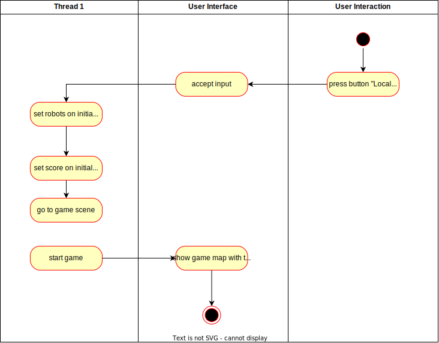

# Use-Case Specification: Starting Single Player Games

# 1. Starting Single Player Games

## 1.1 Brief Description
This use case describes that the player can start a single player game from the main menu. This starts a completely new run, whith most rudimentary spells and robots. A game can be started with optional settings defined from in the main menu.

## 1.2 Mockup
 (outdated)
## 1.3 Screenshots

# 2. Flow of Events

## 2.1 Basic Flow
The player must press the button labelled "play". Then it is checked, whether he is currently in a game. If they do, robots, spells and the score return to their initial state. The game then will be in a running state

### Activity Diagram

### .feature File
[Start Game](../features/start_game.feature)

## 2.2 Alternative Flows
n/a

# 3. Special Requirements
n/a

# 4. Preconditions
The preconditions for this use case are:
1. The game is not in a running state

# 5. Postconditions
The postconditions for this use case are:
1. The game is in a running state
2. Score and robots are in the initial state
