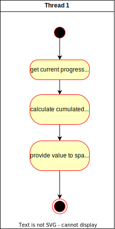

# Use-Case Specification: Robots get Stronger

# 1. Make Robots progressively stronger

## 1.1 Brief Description
This use case describes that robots waves get stronger with progressing time spent in the game.

## 1.2 Mockup

n/a
## 1.3 Screenshots
n/a

# 2. Flow of Events

## 2.1 Basic Flow
At the start of the game the robot waves are relatively simple to defeat. With each wave, they get calculated with more and stronger robots, making it a continuous experience.

### Activity Diagram

### .feature File
n/a

## 2.2 Alternative Flows
n/a

# 3. Special Requirements
n/a

# 4. Preconditions
The preconditions for this use case are:
1. The game is in a running state.
2. At least one robot wave got defeated.
3. A robot wave needs to be spawned.

# 5. Postconditions
The postconditions for this use case are:
1. The next robot wave is active
2. The robots belonging to the wave are spawned
3. The spawned robots are either in higher quantity, of a higher level or a combination of both

