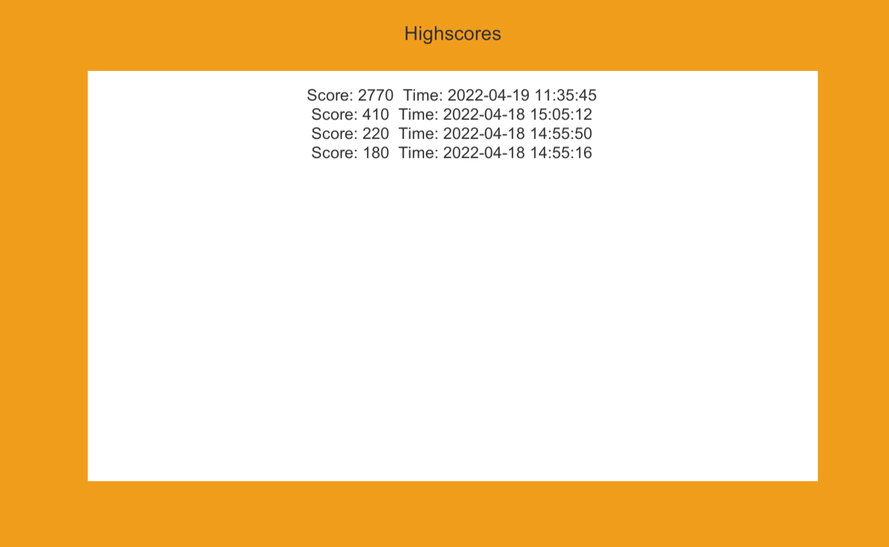
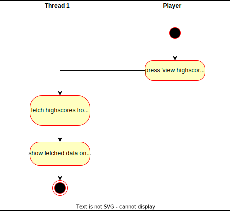

# Use-Case Specification: View Highscore

# 1. View local Highscore

## 1.1 Brief Description
This use case describes that all achieved local highscores can be viewed.

## 1.2 Mockup
 n/a

## 1.3 Screenshots

The Highscores overview.

# 2. Flow of Events

## 2.1 Basic Flow
When in the main menu, the highscores can be customized via the highscores button. There, all scores that were a highscore as well as the time of their achieving can be seen.

### Activity Diagram

### .feature File
[Cast Spell](../features/.feature)

## 2.2 Alternative Flows
n/a

# 3. Special Requirements
n/a

# 4. Preconditions
The preconditions for this use case are:
1. The game is in the main menu
2. A game with a score > 0 has been finished

# 5. Postconditions
The postconditions for this use case are:
1. The game is in the highscores menu
